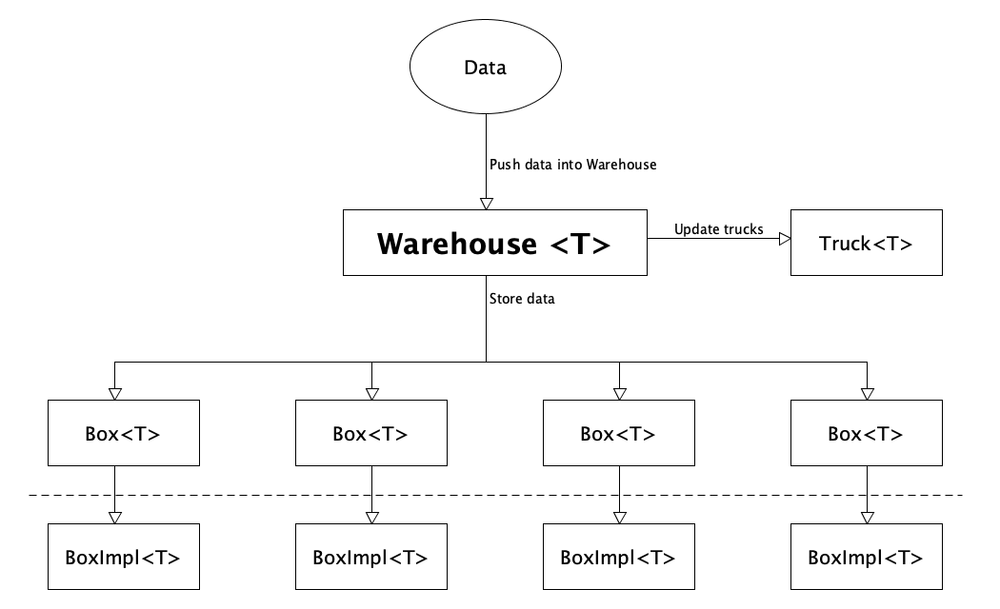

# Warehouse (Pre-Alpha / :construction:  Under construction :construction:)
####  Important: This library is pre-alpha and far from production-ready. However, if you like the idea, feel free to open an issue or contribute a PR.

## Warehouse, Boxes & Trucks - The concepts

TODO Update entities



### Warehouse
Warehouse is an Android library that simplifies object storage, more specifically, storing a collection
of objects. If you have to store a list of books, or a collection of incoming orders, `Warehouse` will help
you with this task. But there's more to that. `Warehouse` allows you to specify in which `Boxes` the
data should be stored.

### Boxes
`Boxes` are an abstraction for data storage backends. There are already some `Box` implementations
ready for usage, such as `FirebaseBox`, `RealmBox` or `FileBox`, storing your data in your storage backend
of choice (Check out the [Supported Boxes](#supported-boxes) section). This allows you to store the same data in different
backends without doing all the synchronization between the backends by yourself. Notice that you can always
implement your own `Box`.

### Trucks
Additionally, there's the concept of `Trucks`. `Trucks` take care of incoming goods. In the concrete case,
a `Truck` receives updates of newly added data into the `Warehouse` and can operate on the incoming data.
`Trucks` can be seen as a nice way to perform some side-effects while storing data. You could track an event,
or compute some extra metrics of the stored data.

### Project origin
The project emerged of the dire need of an abstraction layer handling multiple data backends. All the
data was stored locally in a `Realm` Database. Adding a remote storage option like `Firebase` would be
easy to implement, only requiring an initial data migration. However, users should be able to opt-in for
online storage. Users should remain of full control where their data is stored. Thus, data should always
be stored in one "leading" data backend, adding and removing additional data backends on demand.
This was the date of birth of the idea of `Warehouse`.

## Features

### Multi data backend management
Adding and removing data backends on demand. Data backends are called `Boxes`. A `Box`
is effectively a source where data is stored. It could be a local `Realm` database,
a `File`, the `SharedPreferences` or a `Firebase Realtime Database`. Data will be synced
between the `Boxes`, making it easy to migrate data from one `Box` to another.

This feature allows to add `Boxes` at any point in time, populating it with previously
stored data from the "leading" box.

### Leading Box
A `Warehouse` has a "leading box", which will be the single source of truth,
in cases where conflicts may happen. For example, a local `Realm` database could be the "leading box",  
while having a custom REST data backend implementation (which relies on a network connection).

This is an optional feature and can be configured via the `WarehouseConfiguration`.

### BoxOperation Ledger
TODO Describe Ledger concept

### Internal / External data representation
The key idea of `Warehouse` is to separate the object persistence of the rest of the code.
(You can think of it as a persistence layer and a business logic layer). This concept leads
to the fact that each `Box` implementation might require a different data representation,
meaning a different object. For example, `Realm` requires the stored objects to extend
`RealmObject`, while `Firebase Realtime Database` is a NoSQL database, which cannot properly
handle inheritance out of the box. In those cases it's not advisable to pollute your `data class`
with a library-specific type, making it harder to move to another storage option.

Thus, each `Box` implementation has to manage an own data representation of the persistence layer.
In some cases, this might be the same object as in the business layer. For example, if the data
is just stored in memory. A dedicated persistence data representation isn't necessary since there
are no implementation-specific requirements.

## Api usage

### Setup

```kotlin
val warehouse = Warehouse(
    boxes = listOf(
        LogBox.withTag("LogBox"),
        RealmBox.fromRealm(
            config,
            mapper = RealmMessageMapper, 
            idProperty = "id", 
            idSelector = { it.id }
        ),
        InMemoryBox.default(),
        FirebaseBox.fromDatabase(
            FirebaseDatabase.getInstance().reference.database,
            reference = "/messages",
            idSelector = { it.id }
        ),
        FileBox.fromContext(
            applicationContext,
            fileName = "filename.json",
            mapper = IdentityMapper(),
            idSelector = { it.id },
            fileSerializer = GsonFileSerializer()
        )
    ),
    trucks = listOf(
        SingleCargoTruck { message ->
            showToast(message.toString())
        },
        BatchTruck(batchSize = 2) { messages ->
            showToast("$messages ready to be processed!")
        }
    ),
    WarehouseConfiguration(leaderBox = InMemoryBox.NAME)
)
```

### Store data
```kotlin
warehouse.store(Message("random-id-1", "Recipient", "This is a message"))
    .subscribe()
```

### Retrieve data from a single container
```kotlin
warehouse.getAllFor<RealmBox<*, Message>>()
    .subscribe { messages ->
        showToast("${messages.size} messages loaded")
    }
```

### Retrieve a single element
```kotlin
warehouse["id"].subscribe { messages ->
    showToast("${messages.size} loaded for id")
}
```

## What's missing for the first beta release?

There are a bunch of things that make this library not even suitable for a hobby project.

### General issues
-[ ] Update README.md
-[ ] Test coverage
-[ ] Tests for FirebaseBox
-[ ] Tests for RealmBox
-[ ] Tests for InMemoryBox

### Box issues
-[ ] Initial box synchronization
-[ ] A working RealmBox implementation
-[ ] Full reactive getAll method

### BoxEngine issues
-[x] `idSelector` can handle any data type as `id`, not only string

### Warehouse issues
-[x] Final Warehouse API
-[x] Reset boxes
-[ ] Enable/Disable boxes on the go
-[ ] Switch leading boxes on the go

### Supported BoxEngines

|   **Supported**   |    **Planned**     |    **Potential**     |
|:-----------------:|:------------------:|:--------------------:|
|    Log (Debug)    | Firebase FireStore |         Room         |
|     InMemory      |       SQLite       |    ProtoDataStore    |
|       Realm       | SharedPreferences  | PreferencesDataStore |
| Firebase Database |    Android File    |    Remote / REST     |
|                   |                    |                      |

#### Why is Room only considered "potential"?
Room provides way more than just a "data backend", providing more features than just
saving and retrieving data. Room would only work in a degraded manner, since the whole
querying would not work in companion with `Warehouse`. Also, `Room` requires more work
of developers, which will be mitigated from `Warehouse` to them. Overall, there are a
lot of pitfalls and edge cases, which make `Room` not a prime candidate for a `Box`
implementation. Alternatively, if a relational database is required,
a `SQLiteBox` implementation is planned.

## Warehouse 1.0 Requirements
- Working linting rules (warehouse-rules module) module (e.g. warning if content is not a data class)
- Box-independent query language on top of boxes and a single `warehouse.query()` method.

## Warehouse 2.0

The initial version aims to provide an easy to use API for simple use cases, where
performance is not a driving factor. The main goal is to provide a durable and
migration-friendly storage API. Version 2.0 aims to go further in this direction
and wants to improve performance by adding queries and logs for boxes. In addition,
it should be possible to use Coroutines/Flow instead of solely relying on RxJava.

### Proposed V2.0 changes
- A single `Warehouse` can store an arbitrary amount of different data types, not just a single one.
- Each box has an own Log and allows rollbacks to previous versions
- WarehouseAdapter (like Retrofit) to use either Flow/Coroutines or RxJava
- READ/WRITE atomicity
